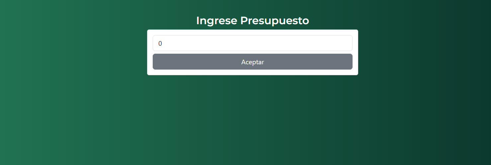
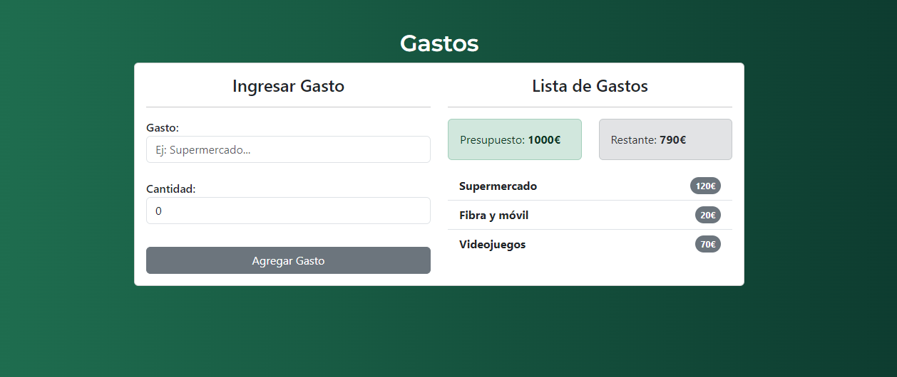

# App Presupuesto

Ingresa un presupuesto inicial y añade gastos para su posterior lectura. Te avisará cuando hayas gastado el 50% y el 75% del presupuesto inicial. No te permitirá gastar más del presupuesto inicial.

## Stack Tecnológico

+ Bootstrap, JavaScript, TypeScript
+ Angular (18.0.5)

## Enlaces

Link al Live: <a href="https://budget-app-angular-rubpri-64jwlq767-rubpris-projects.vercel.app/ingresarPresupuesto" target="_blank">https://budget-app-angular-rubpri-64jwlq767-rubpris-projects.vercel.app/ingresarPresupuesto</a>

## Imágenes de la App

## Perfiles

